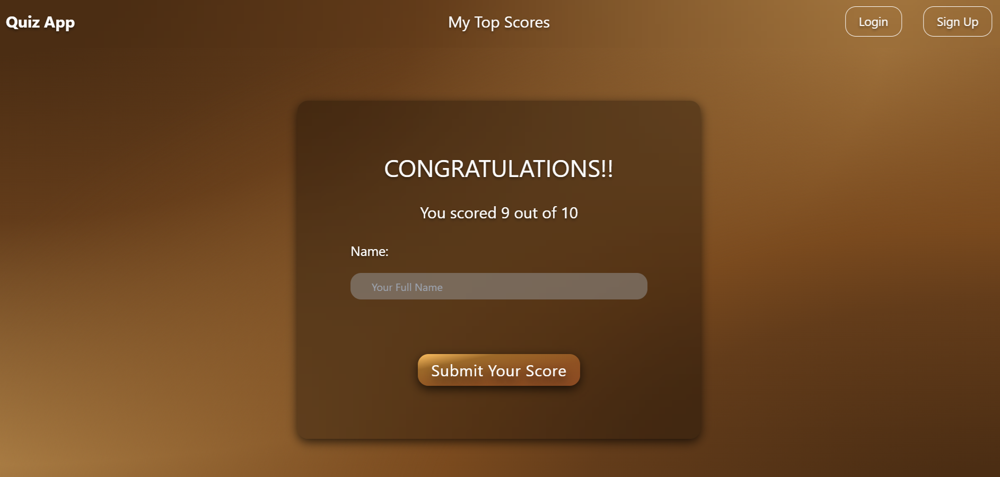

# REACT QUIZ

## Tagline

**Test Your Knowledge Across Diverse Topics! 🧠**

## Description

REACT QUIZ is an engaging and interactive quiz application designed to challenge your knowledge across a variety of topics. With categories ranging from art to science, and sports to culture, you can select your area of interest and dive into a series of timed questions. Each quiz consists of up to 10 questions, and you have 30 seconds to answer each one. After completing the quiz, you can save your score and compare it with others on the top scores leaderboard.

## Live Demo

[Check out the live demo](https://warsames-quiz.vercel.app/)

---

## Table of Contents

1. [Features](#features)
2. [Screenshots](#screenshots)
3. [Installation](#installation)
4. [Usage](#usage)
5. [Support](#support)
6. [License](#license)

---

## Features

- **Diverse Categories 🎨🔬📚🏀**: Choose from a variety of quiz categories including art, science, maths, sports, history, geography, culture, and health.
- **Timed Questions ⏳**: Each quiz has up to 10 questions with a 30-second time limit per question.
- **Score Saving 💾**: Save your score upon completing a quiz and view it on the top scores leaderboard.
- **Responsive Design 📱**: Enjoy a seamless experience on any device, thanks to a responsive design built with React and Tailwind CSS.

## Screenshots

### Landing Page


### Quiz in Progress


### Submit Score



### High Scores


## Installation

To set up and run REACT QUIZ locally, follow these steps:

1. **Clone the Repository 🖥️**
   ```bash
   git clone https://github.com/abdinasir1warsame/react-quiz.git
   ```
2. **Navigate to the Project Directory**

   ```bash
   cd react-quiz
   ```

3. **Install Dependencies**
   ```bash
   npm install
   ```
4. **Install Dependencies**

   ```bash
   npm start
   ```
